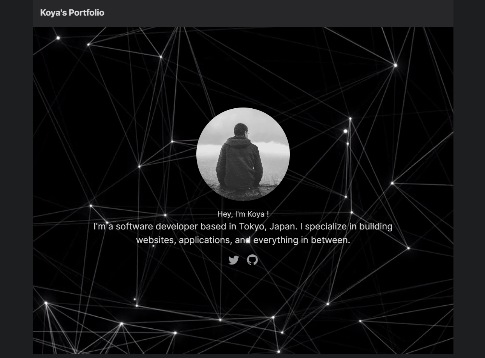

# Koya's Portfolio
Welcome to my personal portfolio! <br />
This repository contains the code and content for my portfolio website, where I showcase my projects, experiences, and skills.

## Portfolio Screenshot

https://koya-tech.github.io/




## Getting Started
### Prerequisites
- Node.js
- NPM or Yarn (whichever you prefer)
### Installation
1: Clone the repository:
```bash
git clone https://github.com/koya-tech/koya-tech.github.io.git
```

2: Navigate to the directory:

```bash
cd koya_githubpages
```

3: Install the dependencies:

```bash
npm install
```

or using Yarn:

```bash
yarn
```

4: Start the development server:

```bash
npm run dev
```

or using Yarn:

```bash
yarn dev
```

Visit http://localhost:3000 to see the app running.

## Deployment
This site is deployed using GitHub Pages. You can visit the live site here.

## Technologies Used
- Next.js
- Tailwind CSS
- And more...
## Contact
Feel free to reach out to me for collaborations, questions, or just a chat!

- Twitter : [@koya_tech](https://twitter.com/koya_tech)
## License
This project is licensed under the MIT License. See the LICENSE file for more details.

